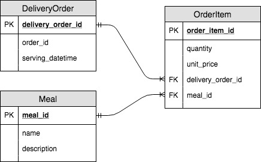

# README - Ordoo

## Installation

Fork the repo and clone to local
```
git clone url-of-fork-repo
```

Place this two gems in `Gemfile`.
```
gem 'faker'
gem 'database_cleaner'
```
Install the gems
```
bundle install
```
* faker
  - generate fake data
* database_cleaner
  - placed in seed.rb to clean database before seeding the data.


Create and migrate database
```
rails db:create
rails db:migrate
```

Generate data
```
rails db:seed
```

Start rails server
```
rails server
```


## Model
```
DeliveryOrder
  order_id: String
  serving_datetime: DateTime

OrderItem
  delivery_order_id: Integer
  meal_id: Integer
  quantity: Integer
  unit_price: Integer #in cents

Meal
  name: String
  description: String
```

## Erd

